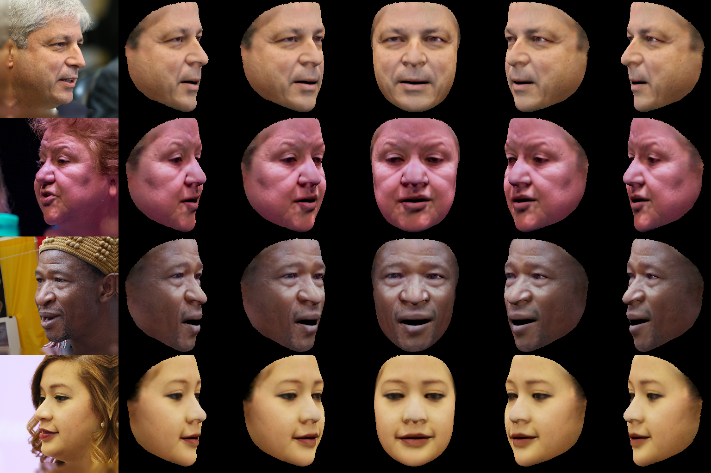

# weak_UV
Weakly-Supervised Photo-realistic Texture Generation for 3D Face Reconstruction
# The workflow of our method

# From image to in-complete uvmap

# reconstruction results

Required packages:

pytorch3d https://github.com/facebookresearch/pytorch3d

facenet-pytorch https://github.com/timesler/facenet-pytorch

contiguous_params https://github.com/PhilJd/contiguous_pytorch_params

