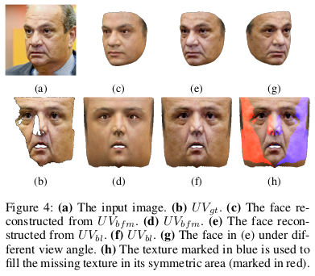

# weak_UV
Weakly-Supervised Photo-realistic Texture Generation for 3D Face Reconstruction
## Overview of our method

## From image to in-complete UV-map

## Poisson blending of the in-complete UV-map and the BFM based UV-map

## Reconstruction results

## Required packages:

pytorch3d https://github.com/facebookresearch/pytorch3d

facenet-pytorch https://github.com/timesler/facenet-pytorch

contiguous_params https://github.com/PhilJd/contiguous_pytorch_params

